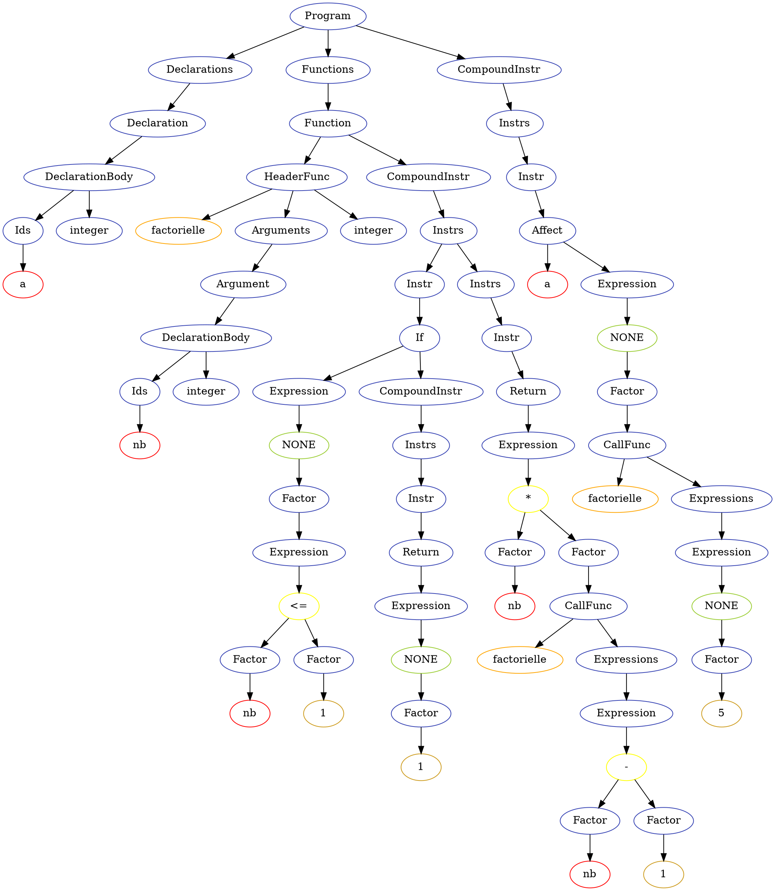
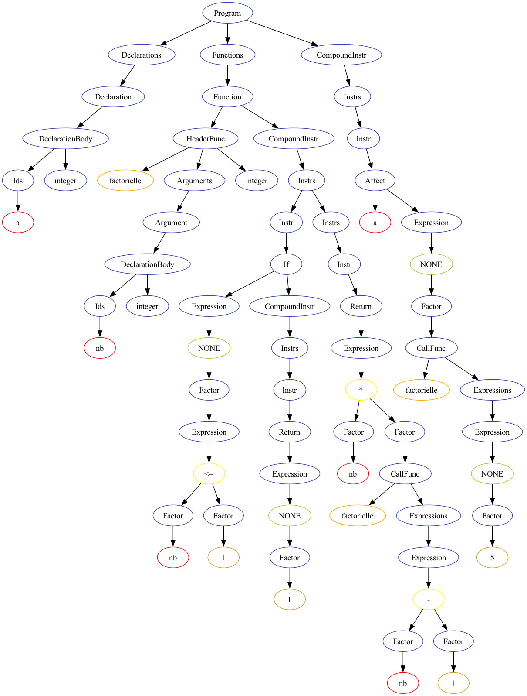

# AST generation

Because the full grammar AST is contained in this program, it's possible to
visit this AST and generate a graphical representation of it.

To achieve that, we're using `dotty` from the `graphviz` package.

## Examples

```sh
./cubs -O check/execution/func-recursive.mmc
```

It will generates a dotty representation:


## Generating an image

```sh
./cubs -O check/execution/func-recursive.mmc > func-recursive.dot
dot -Tpng func-recursive.dot > func-recursive.png
```

Generated image will be:

